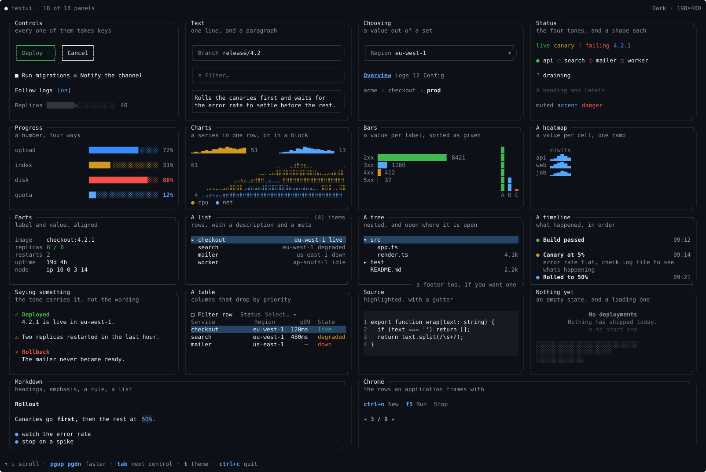
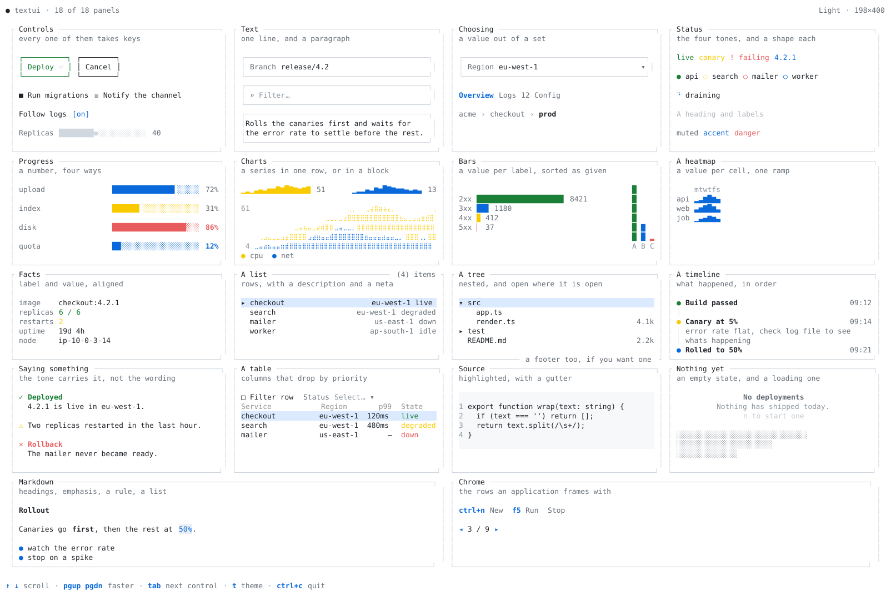
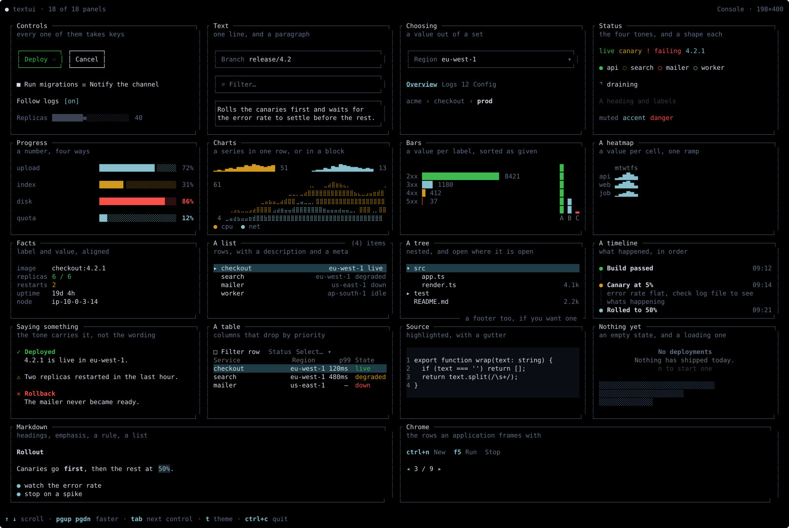
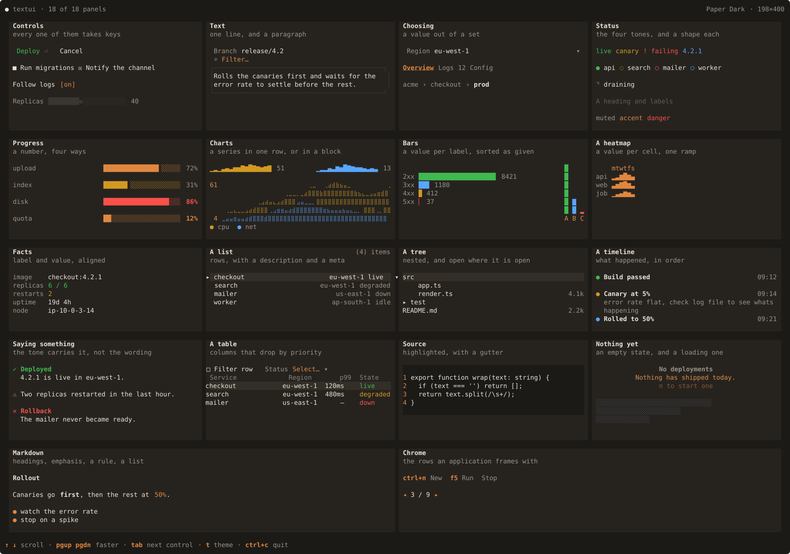
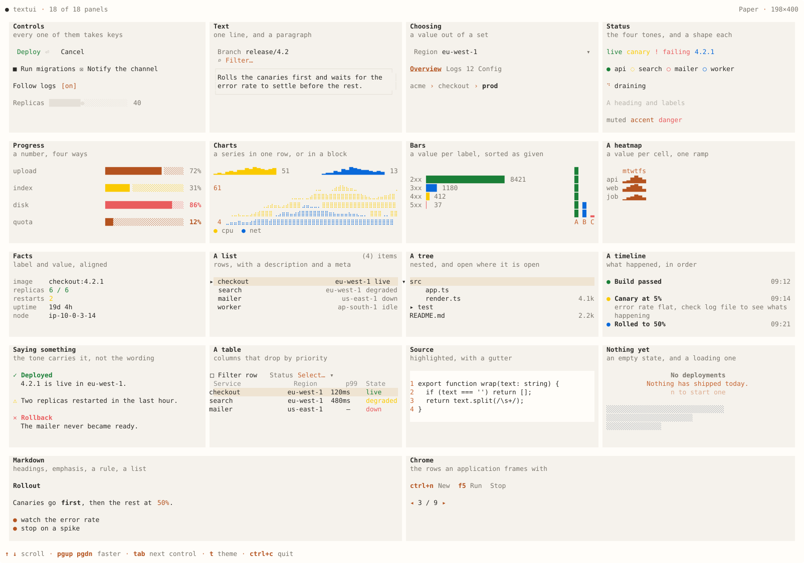
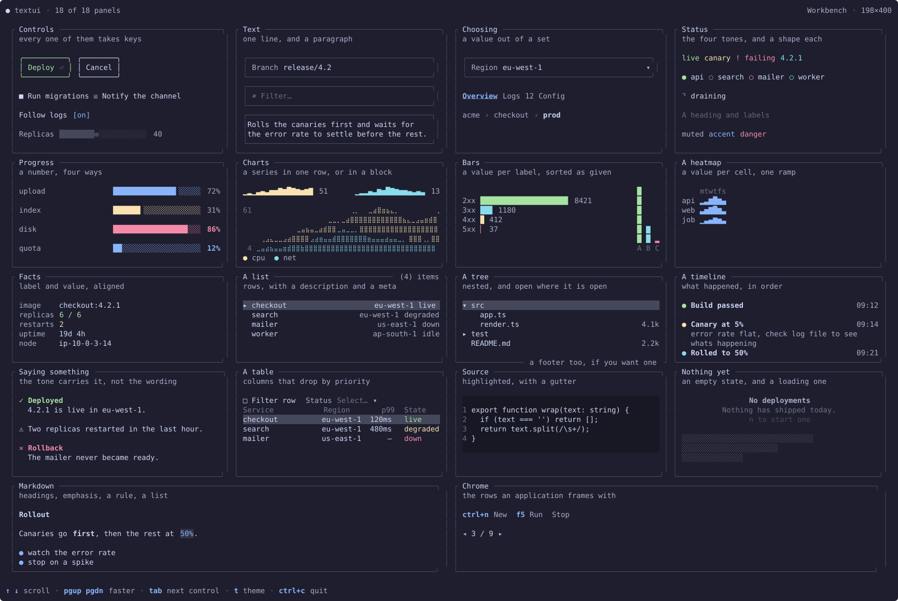
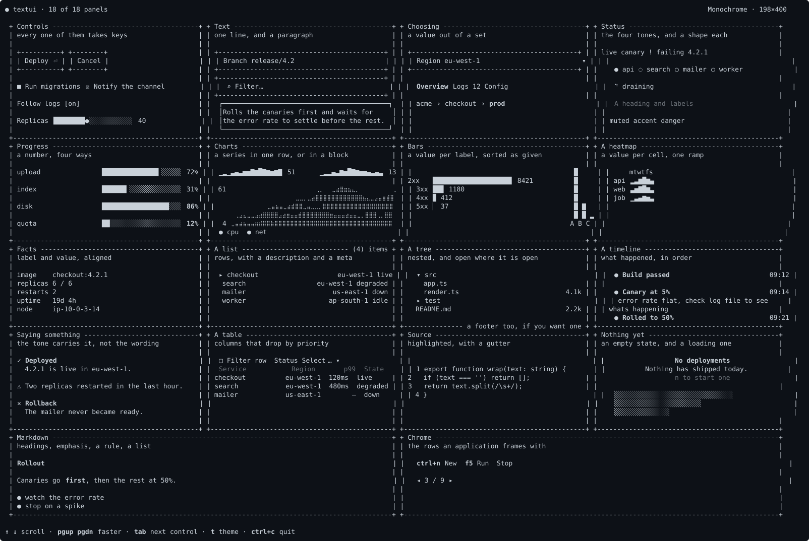

# TextUI

A dependency-free TypeScript terminal UI runtime. Screens are plain data; JSX is one way to write them.

```tsx
import { render } from 'textui';
import { registerBuiltins } from '@textui/widgets';

const { waitUntilExit } = render(<Dashboard />, { onBoot: registerBuiltins });
await waitUntilExit();
```

> Status: pre-1.0. The surface is still moving.

## The one idea

**JSX compiles to data.** `<Row gap={1}/>` and `{ component: 'Row', gap: 1 }` are the same value, and the runtime mounts either. A screen can be written in TypeScript, loaded from JSON, generated, edited or sent over a wire without the runtime changing - and components are resolved by name at mount time, so what renders is a registration rather than an import.

Everything else follows from that: one reactive store addressed by paths, typed registries for components, commands, themes, shells and resources, and a renderer that diffs cells rather than redrawing frames.

## Why TypeScript, and how close it is to needing no build

Types are stripped rather than compiled now. Node has erased them since 22.6
behind a flag, and by default since 23.6 - so a `.ts` file with no non-erasable
syntax in it is a file Node runs. Nothing transpiles it; the annotations are
skipped the way a comment is.

That is the direction this library is aimed at. It has **no dependencies**, so
the only thing between the source and a `node` invocation is the syntax it uses
- and most of the syntax is already fine. Types, interfaces, generics,
`satisfies`, `as`, `import type`: all erasable, all stripped.

**What is not, here:** eleven parameter properties (`constructor(private x: T)`)
across ten files. That form declares a field *and* assigns it, so there is
runtime behaviour inside a type annotation and stripping cannot be correct.
Enums and value-carrying namespaces are the other two, and this codebase has
neither.

`"erasableSyntaxOnly": true` in the tsconfig makes the compiler refuse the
non-erasable forms, so the constraint is enforced rather than remembered. The
eleven are a mechanical change - the field written out and assigned in the
body. Worth doing before it is worth claiming.

## Packages

| Package | What it is |
| --- | --- |
| [`textui`](packages/facade) | One install: the runtime, a terminal, and `render`. Start here |
| [`@textui/core`](packages/core) | The runtime: store, registries, renderer, hooks, the four host primitives |
| [`@textui/widgets`](packages/widgets) | The component catalog: layout, display, controls, data, overlays, charts |
| [`@textui/terminal`](packages/terminal) | Terminal adapters, capability detection, ANSI writing, input decoding |
| [`@textui/testing`](packages/testing) | Headless harness: semantic queries, input, resizing, time |
| [`@textui/cli`](packages/cli) | `textui init / add / create / doctor`, and primitives for your own CLI |
| [`components/`](components) | The source-copy registry - components you own, not import |
| [`playground/`](playground) | The showcase, fourteen focused playgrounds, and a filesystem explorer |

## Documentation

Published at **<https://softov.github.io/textui/>**, and readable in [`docs/`](docs/README.md) as plain markdown.

Start here:

| Document | What it answers |
| --- | --- |
| [Getting started](docs/getting-started.md) | From nothing to a running application |
| [The vocabulary](docs/vocabulary.md) | The words everything else assumes |
| [Architecture](docs/architecture.md) | The model: store, graph, registries, surfaces, shells |
| [Decisions and tradeoffs](docs/decisions.md) | What was chosen, and what it cost |

Then by subsystem:

| Section | What it covers |
| --- | --- |
| [Store](docs/store/README.md) | Paths, scopes, computed, collections, providers, events |
| [Components](docs/components/README.md) | The catalog, how to write one, and the templates |
| [Themes](docs/themes/README.md) | Tokens, glyphs, borders, capability downgrade, syntax |
| [Platform](docs/platform/README.md) | Commands, keybindings, focus, layers, screens, extension points |
| [Terminal](docs/terminal/README.md) | Adapters, capabilities, managed and embedded sessions |
| [Documents](docs/documents/README.md) | Resource kinds, providers, viewers, editors, buffers |
| [CLI](docs/cli/README.md) | The developer CLI and the registry model |
| [Testing](docs/testing.md) | The harness, and what to assert |

## A quick taste

> *Let's cut to the chase, shall we?*

Here's what TextUI actually looks like and what it can do.


### theme `dark`
<p align="center">
  
</p>

### theme `light`
<p align="center">
  
</p>

### theme `console`
<p align="center">
  
</p>

### theme `paper-dark`
<p align="center">
  
</p>

### theme `paper-light`
<p align="center">
  
</p>

### theme `workbench`
<p align="center">
  
</p>

### theme `mono`
<p align="center">
  
</p>

Now let's break down how it's built.

## Development

```bash
pnpm install
pnpm build          # every package
pnpm typecheck      # every workspace
pnpm test           # every suite
pnpm dev --list     # the playgrounds
pnpm dev gallery    # open one
```

The docs site is Jekyll, and needs no Ruby on your machine - it builds in a
container:

```bash
scripts/docs-serve.sh           # live, with reload, at localhost:4000/textui/
scripts/docs-serve.sh --build   # build once, into docs/_site
scripts/docs-preview.py         # serve what was built, at localhost:8000/textui/
scripts/docs-preview.py --host 0.0.0.0   # ...and reachable from the network
node scripts/check-docs.mjs     # the nav tree, links and titles
```

`docs-preview.py` exists because the site is built with `baseurl: /textui`, so every link in it is absolute at `/textui/...`. A plain `python -m http.server` over `docs/_site` 404s on all of it; this one mounts the site under the prefix the pages actually ask for.

Node ≥ 22, pnpm 10.

## The acceptance test

The three layouts this project started from - a dense bordered console, an airy borderless report, and a workbench frame - are one architecture with three registrations. `playground/test/playgrounds.test.tsx` mounts the same component under all of them, and under six themes, at three terminal widths, with and without Unicode and colour. If a shell ever needs a component the others cannot use, the boundary is in the wrong place.

## License

MIT
